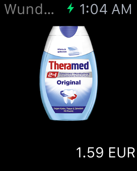
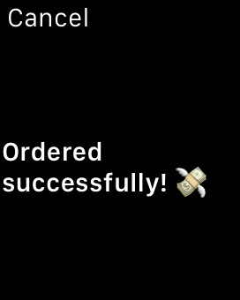

# WatchButton




Software version of the [Amazon Dash Button][2] on the ᴡᴀᴛᴄʜ. Uses iBeacons
to determine the room you are in and contextually offers you to buy a product.
By utilizing the [commmercetools][3], PayPal and [Contentful][4] APIs on the phone, custom backend
code is not needed.

## Building

```bash
$ make pod
$ make all
```

[1]: http://www.ecomhack.io
[2]: https://www.amazon.com/oc/dash-button
[3]: http://www.commercetools.com/de/
[4]: https://www.contentful.com

